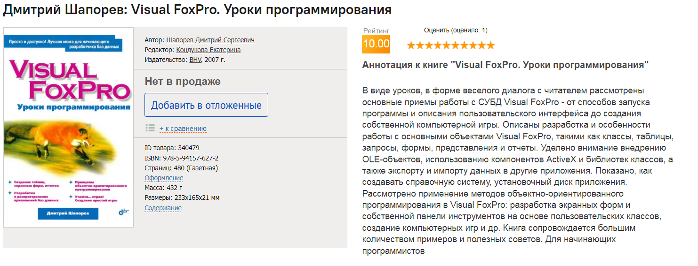

## Всем привет, я Дмитрий Шапорев

### Работаю инженером програмистом, стаж более 20 лет... Основной стек - Visual FoxPro и не только... На этом древнем :) языке программирования я написал немало специализированных приложений для своей организации. Сейчас я перешел на более современный уровень и разрабатываю небольшие приложения на Python, Flask, JavaScript
### Что касается Visual FoxPro - и даже написал учебник, который вышел в свет в далеком 2005 году в питерском издании "BHV-Петербург":

