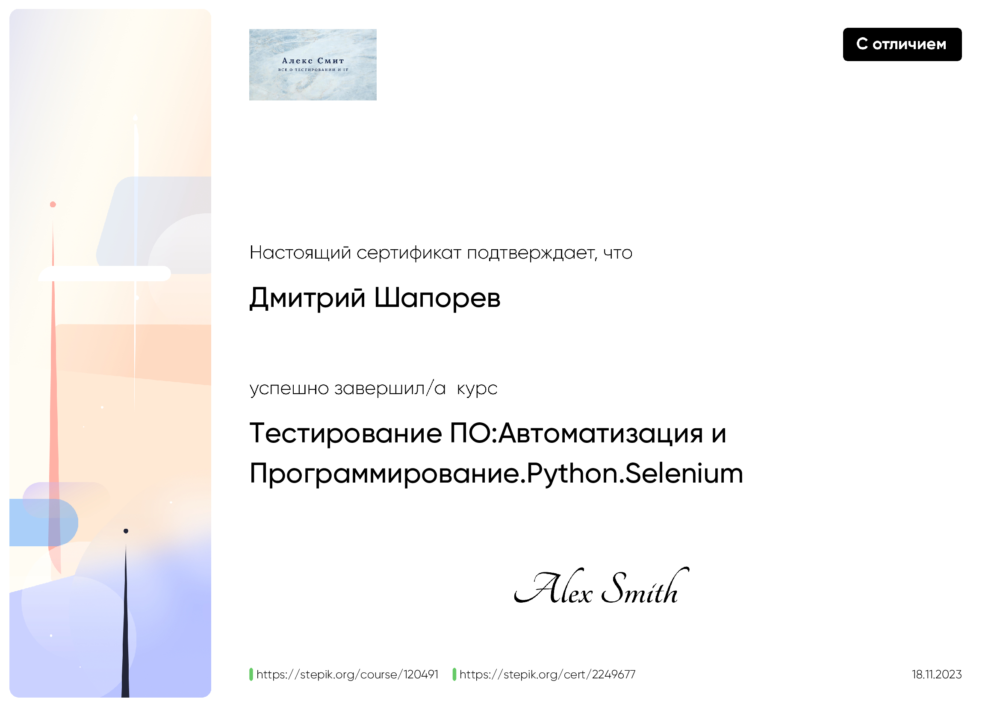
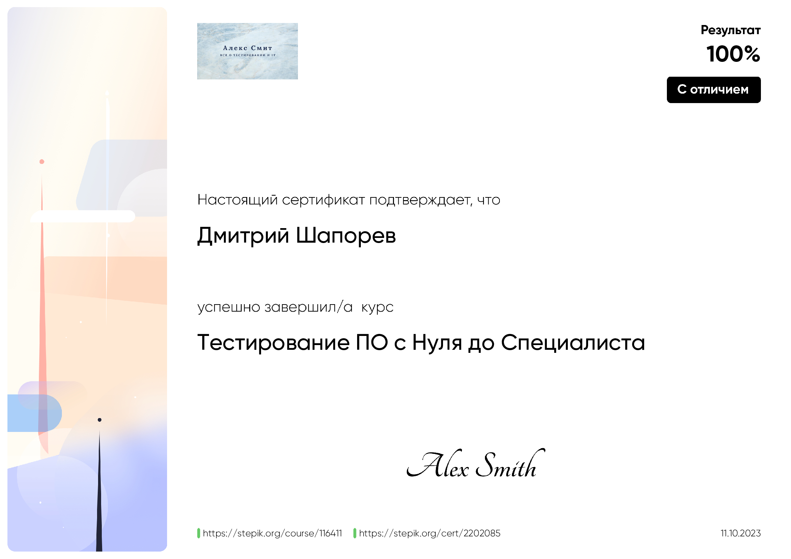

<h3 >Всем привет, я Дмитрий Шапорев</h3>

<h3> Работаю инженером програмистом, стаж более 20 лет... Основной стек - Visual FoxPro и не только... На этом древнем :) языке программирования я написал немало специализированных приложений для своей организации. Сейчас я перешел на более современный уровень и разрабатываю небольшие приложения на Python, Flask, JavaScript</h3>
<h3> Что касается Visual FoxPro -  даже написал учебник, который вышел в свет в далеком 2005 году в питерском издании "BHV-Петербург":</h3>

  
  
  
  
  

<h3>Теперь о тестировании. Как программиста, знающего "изнутри" потенциальные проблемы, возникающие при эксплуатации программного обеспечения, меня очень интересовал этот вопрос, поэтому решил досконально изучить и эту сферу деятельности. Окончил три курса (все с отличием) по тестированию ПО. Больше интересует, конечно, автоматизация. Но готов рассмотреть и предложения по ручному тестированию</h3> 
<h3>Мои сертификаты:</h3>

    
  
  
 
  

<h3>Ключевые навыки:</h3>

  
  
  
  
  
  
  
  
  
  
  
  

